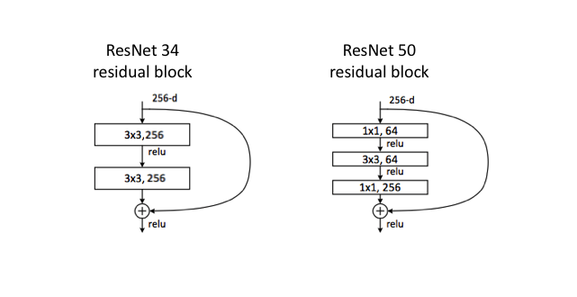

# ResNet-Implementation-from-scratch

## What is ResNet?
ResNet, short for Residual Network is a specific type of neural network that was introduced in 2015 by Kaiming He, Xiangyu Zhang, Shaoqing Ren and Jian Sun in their paper “Deep Residual Learning for Image Recognition”.

## Need for ResNet?

Mostly in order to solve a complex problem, we stack some additional layers in the Deep Neural Networks which results in improved accuracy and performance. The intuition behind adding more layers is that these layers progressively learn more complex features. For example, in case of recognising images, the first layer may learn to detect edges, the second layer may learn to identify textures and similarly the third layer can learn to detect objects and so on. But it has been found that there is a maximum threshold for depth with the traditional Convolutional neural network model.
